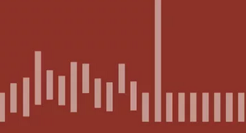

# Algorithms-Summer-2015

**Algorithms** from **Princeton University** on Coursera

Class Code are copied straight from the slides written in Java. Then I translate them into **Swift**.

Homework code is written by me. Again, I will write them both in J**ava and Swift**. 

Feel free to look at or use for your personal learning.

